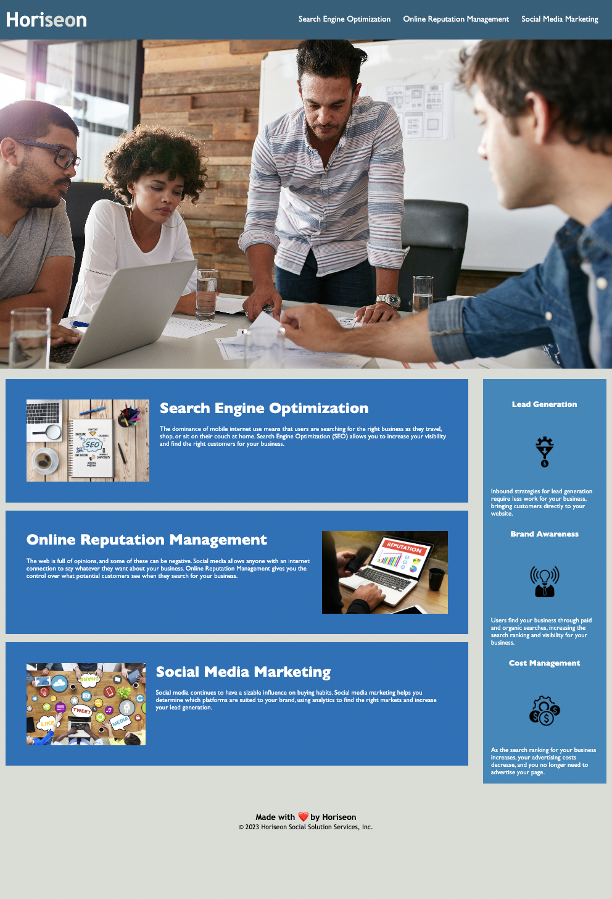

# Horiseon Accesibility Project
An edit of the existing code for the Horiseon webpage to increase the accesibility of the page.
## Why?
Accesibility is increasingly important in the world of web design, not just for search engine optimization but for people with disabilities aswell.  Adding descriptiond to images for screen readers, using semantic HTML elements, and organizing the code can provide a better experience for all users.
## Screenshots

## Links
[Horiseon Webpage](https://phechzzz.github.io/Horiseon-accessibility-project/#social-media-marketing)

